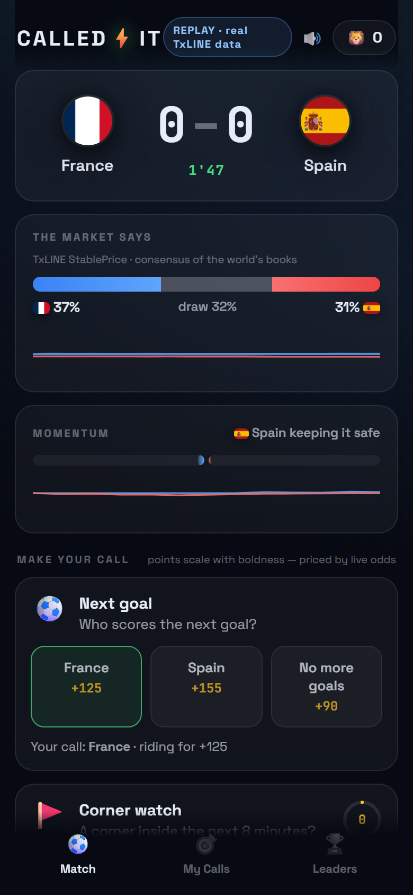

<div align="center">

# CALLED ⚡ IT

### Call the match before it happens. Prove it forever.

**The World Cup second screen where bragging rights become cryptographic.**

*Built for the TxODDS World Cup Hackathon — Consumer & Fan Experiences track.*



</div>

---

## The problem

Every fan on Earth has screamed **"I called it!"** — the sub who scores, the penalty that was coming, the collapse everyone saw except the commentators. And every fan has the same problem: *nobody believes you after the fact.*

Group chats are where great calls go to die. Screenshots are fakeable. Memories are convenient.

## What CalledIt does

CalledIt is a live second-screen game you open next to the TV:

1. **The match talks to you.** TxLINE's event stream drives a live *momentum engine* — when Spain string together danger-zone possessions, the app flashes a hot card: *"Spain are surging — goal in the next 2 minutes?"* You get seconds to lock your call, often **before the TV commentators have caught up**.
2. **Boldness pays.** Every card is priced from TxLINE **StablePrice consensus odds** — the same numbers the world's books agree on. Call the 76% penalty and earn +20. Call the 14% lightning goal and earn +370. Streaks multiply.
3. **Winning mints proof.** A correct call becomes a **Called-It receipt**: a signed statement (what you called, when you locked it, what TxLINE event settled it) whose hash is committed to **Solana**. The receipt page shows *"locked in 2 minutes before it happened"* — and anyone can re-verify the chain: payload → sha256 → batch root → on-chain transaction.
4. **Squads.** Create a squad, drop the 6-character code in the group chat, and the argument about who actually understands football is finally settled by a leaderboard.

No signup, no email, no wallet needed to play — pick an emoji, type a name, you're in the stadium in 5 seconds.

## Why this is different

Prediction apps ask you *"who wins?"* once and go quiet. CalledIt is built out of the **moment-level** data most consumer apps never see:

- possession phases (`safe → attack → danger → high danger`) become a visible momentum pulse and trigger moment cards at exactly the right second;
- `possible` events (TxLINE's "goal threat" signals), penalties, and **VAR reviews** become instant drama cards (*"Will the decision stand?"*);
- goals are handled the way brains handle them — instantly celebrated, **VAR-safely settled** (a goal overturned 12 seconds later never pays out);
- StablePrice implied probabilities price every question, so points mean something.

And the receipts angle gives a consumer product something crypto is actually *for*: *provable* bragging rights, anchored to the same chain TxLINE itself anchors its data to.

## Judge quickstart (zero config)

```bash
npm ci
cd web && npm ci && npm run build && cd ..
npm start          # http://localhost:3000
```

Out of the box the app replays **real captured TxLINE data** — France vs Spain, fixture `18237038`, 1,027 score events + 6,535 StablePrice updates, including a penalty, a VAR-overturned goal and two real goals — verbatim, at 2× speed, looping. The banner says exactly what you're looking at.

With env vars it attaches to **live TxLINE devnet fixtures** automatically (see below) — during a live match the same UI runs on the live SSE streams.

### Demo controls (for reviewing key moments)

```bash
curl -X POST localhost:3000/api/admin/replay -H 'Content-Type: application/json' \
  -d '{"key":"letmein","action":"seek","value":18}'   # jump to the penalty (19')
# actions: play | pause | restart | speed (value=multiplier) | seek (value=match minute)
```

## Live mode

```bash
DATA_MODE=auto \
TXLINE_BASE_URL=https://txline-dev.txodds.com \
TXLINE_API_TOKEN=<your activated TxLINE token> \
ANCHOR_KEYPAIR=.keys/anchor.json \
npm start
```

The server polls `/api/fixtures/snapshot`, opens sessions for upcoming/live fixtures, and feeds `/api/scores/stream` + `/api/odds/stream` (SSE) into the same engine the replay uses. The session picker in the app shows every available match; live ones get the red dot.

The TxLINE token comes from the standard flow: on-chain `subscribe` (free World Cup tier, service level 1) → sign `txSig::jwt` → `POST /api/token/activate`. See [TxLINE quickstart](https://txline-docs.txodds.com/documentation/quickstart).

## How TxLINE powers it (endpoints used)

| Endpoint | Used for |
|---|---|
| `POST /auth/guest/start` | guest JWT for every API call |
| `GET /api/fixtures/snapshot` | schedule, team names, session discovery |
| `GET /api/scores/stream` (SSE) | live match engine: goals, cards, corners, penalties, VAR, possession phases, clock, lineups |
| `GET /api/odds/stream` (SSE) | live StablePrice: win-prob bar, card pricing |
| `GET /api/scores/historical/{fixtureId}` | capturing real completed matches for replay mode |
| `GET /api/odds/updates/{epochDay}/{hour}/{interval}` | historical StablePrice for replay pricing |

Markets consumed: `1X2_PARTICIPANT_RESULT` (win probability + "market says" display), `OVERUNDER_PARTICIPANT_GOALS` ladder (probability of another goal), `ASIANHANDICAP_PARTICIPANT_GOALS` line 0 (which team the next goal belongs to). Full-time markets only — half markets are filtered by `MarketPeriod`.

## Architecture

```
                         ┌─────────────────────────────────────────┐
   TxLINE devnet         │                CalledIt server          │
┌───────────────┐  SSE   │  ┌───────────┐   ┌──────────────────┐   │   WS    ┌──────────┐
│ /scores/stream ├───────┼─►│ MatchState│──►│ ProphecyEngine   │   ├────────►│ React app │
│ /odds/stream   ├───────┼─►│ (VAR-safe │   │ cards · pricing  │   │         │ (mobile-  │
└───────────────┘        │  │  goals,   │   │ settlement       │   │         │  first)   │
┌───────────────┐ replay │  │  momentum,│   └────────┬─────────┘   │         └──────────┘
│ captured real  ├───────┼─►│  odds)    │            │ receipts    │
│ TxLINE data    │       │  └───────────┘   ┌────────▼─────────┐   │
└───────────────┘        │                  │ ReceiptAnchor    │   │
                         │                  │ sha256 batches → │   │
                         │                  │ Solana devnet tx │   │
                         │                  └──────────────────┘   │
                         └─────────────────────────────────────────┘
```

- `server/matchstate.js` — event-time state machine over the raw feed (goal amendment dedupe, 20s VAR-safe confirmation, danger decay, odds normalisation)
- `server/prophecy.js` — card generation + odds-based pricing (`pts = 60·(1−p)/p`, clamped) + settlement from subsequent events
- `server/receipts.js` — receipt hashing, batch roots, Memo transactions on Solana devnet, independent re-verification
- `server/replay.js` — replays captured timelines through the identical ingest path (event-time logic ⇒ replay speed can't break settlement)
- `web/` — React + hand-rolled design system; WebSocket snapshots at 2s + instant pushes

Run the engine tests: `npm test` (goal confirmation, VAR overturn, card settlement, receipt chain).

## The receipts (Solana)

Winning calls are hashed (`sha256` of the signed statement) and batched into a Memo transaction on Solana devnet, e.g.:

[`21k7BCtjaevXh1u4KT1gJP8Y6qkr2xWA999HFtKtyn5NiEuDv6qf1xqhf8m8WoDmDDDrbJ1v2dwAX312Pj2aeZaH`](https://explorer.solana.com/tx/21k7BCtjaevXh1u4KT1gJP8Y6qkr2xWA999HFtKtyn5NiEuDv6qf1xqhf8m8WoDmDDDrbJ1v2dwAX312Pj2aeZaH?cluster=devnet)

The `/verify` page re-runs the whole chain in front of the user. The settling *event* is itself TxLINE data that TxODDS Merkle-anchors on Solana — so both halves of "you called it before it happened" are independently checkable: your call's timestamp (our anchor) and the event's timestamp (TxLINE's).

## Business model

- **Free**: play, squads, receipts.
- **Premium squads** (season pass): private leagues with prizes, custom card packs, historical stats.
- **B2B white-label**: broadcasters and sportsbooks embed CalledIt as their second-screen layer — LiveLike-style engagement, but with *verifiable* settlement they don't have to operate themselves (TxLINE settles, the chain proves). Fan engagement platforms are a $10B+ market growing at ~20% CAGR; none of the incumbents can prove their settlements.
- **Sponsored moments**: "This VAR card brought to you by …" — native ad units that appear exactly at peak attention.

## Config reference

| env | default | |
|---|---|---|
| `DATA_MODE` | `auto` | `auto` / `live` / `replay` |
| `TXLINE_BASE_URL` | `https://txline-dev.txodds.com` | mainnet: `https://txline.txodds.com` |
| `TXLINE_API_TOKEN` | — | activated TxLINE token (live mode) |
| `TXLINE_FIXTURE_ID` | auto | pin one fixture |
| `REPLAY_FILE` | France vs Spain | any file from `scripts/capture.js` |
| `REPLAY_SPEED` | `2` | match-time multiplier |
| `ANCHOR_KEYPAIR` / `ANCHOR_SECRET` | — | Solana devnet keypair for receipt anchoring |
| `DEMO_BOTS` | `8` | demo squad bots (0 to disable; disclosed in-app as "demo") |
| `ADMIN_KEY` | `letmein` | replay control key |

## Capturing another real match

```bash
TXLINE_API_TOKEN=... node scripts/capture.js            # list fixtures
TXLINE_API_TOKEN=... node scripts/capture.js 18257865 france-england
REPLAY_FILE=data/replays/france-england.json npm start
```

## License

MIT
